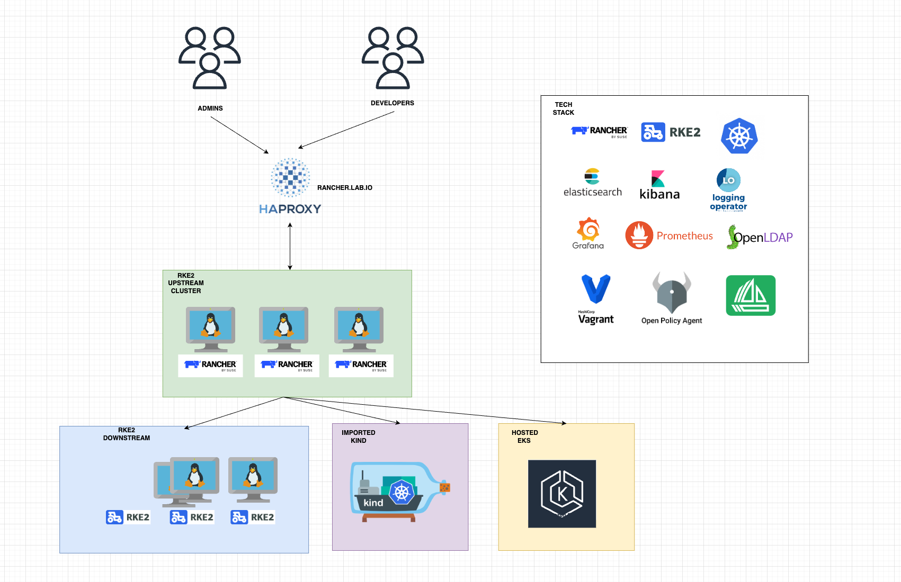

## LAB ENVIRONMENT

### Lab Architecture and Teck Stack



### Install Prerequisite
For macOS 
```
# Install vagrant
brew install --cask vagrant

# shell autocomplete
vagrant autocomplete install --bash --zsh

# Install vmware and get personal use licence from https://customerconnect.vmware.com/en/evalcenter?p=fusion-player-personal-13
brew install --cask vmware-fusion

# Install vmware utility
brew install vagrant-vmware-utility
vagrant plugin install vagrant-vmware-desktop
```

For windows
```
# Disable Hyper-V on Powershell
Disable-WindowsOptionalFeature -Online -FeatureName Microsoft-Hyper-V-All

# Download and install vagrant from https://developer.hashicorp.com/vagrant/downloads 
# Download and install vmware utility https://developer.hashicorp.com/vagrant/downloads/vmware 

# Install vagrant vmware provider
vagrant plugin install vagrant-vmware-desktop
```

### Provision VMs and Create Upstream Cluster

```
vagrant up

# ssh to server
vagrant status 
vagrant ssh upstream-01

# Check kubernetes cluster
sudo -i 
k get nodes 
k get pods -A
```

